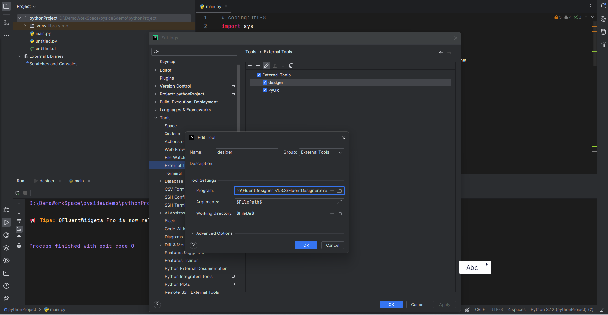
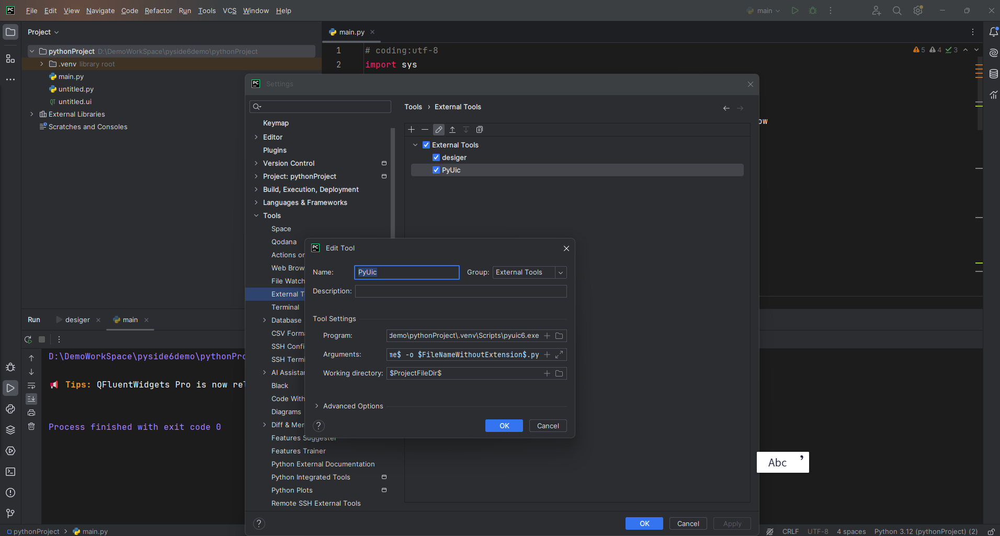
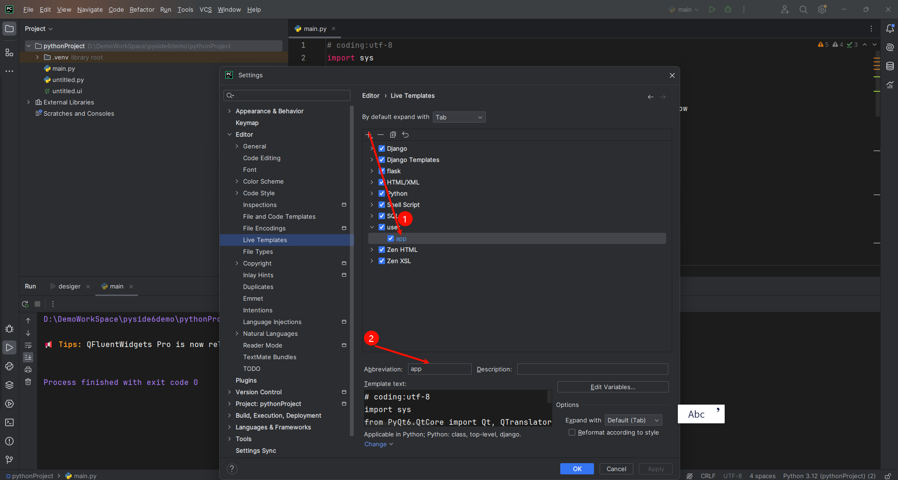
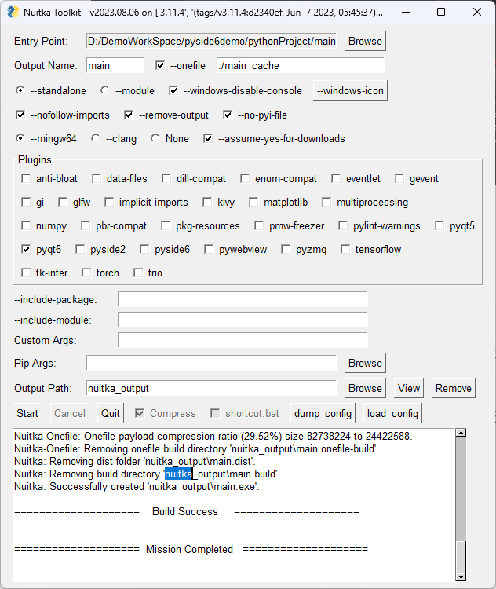

[TOC]

## python fluent程序开发

### 开发环境搭建

首先使用包管理器安装fluent UI环境

```powershell
uv pip install PyQt6-Fluent-Widgets -i https://pypi.org/simple/
```

查看安装列表

```powershell
uv pip list
```

pycharm 配置pyqt的External Tools

designer



pyuic



配置live template



### pyqt程序Nuitka打包

1.首先下载nuitkaui Toolkit打包程序

python安装nuitka包

```powershell
uv pip install nuitka
```

nuitkaui依赖程序下载，nuitkaui需要winlibs_mingw进行编译，而且需要安装提示的指定的版本，而且必须是zip的压缩包，放到指定的目录，程序会自动解压缩

[下载](https://hub.whtrys.space/brechtsanders/winlibs_mingw/releases/download/13.2.0-16.0.6-11.0.1-msvcrt-r1/winlibs-x86_64-posix-seh-gcc-13.2.0-llvm-16.0.6-mingw-w64msvcrt-11.0.1-r1.zip)

winlibs-x86_64-posix-seh-gcc-13.2.0-mingw-w64msvcrt-11.0.1-r1.zip版本下载放到指定目录即可

2.ccache安装

[下载](https://gh.con.sh/https://github.com/ccache/ccache/releases/download/v4.10.1/ccache-4.10.1-windows-x86_64.zip)

配置ccache到环境变量，方便编译时调用

### Nuitka打包参数



### 注意

1. Nuitka打包程序不要放在中文目录中否则打包会报错
2. 系统关联的解压程序不要放在中文目录中，nuitkaui调用解压程序会报错
3. pycharm git提交时忽略文件不是.idea 是放在git中的忽略文件
